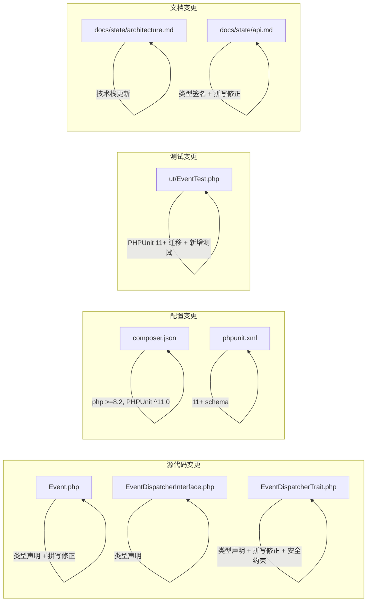

# Design Document

`oasis/event` 2.0.0 release 的设计文档，所属 spec 目录：`.kiro/specs/release-2.0.0/`。

---

## Overview

本设计覆盖 `oasis/event` 从 1.x（PHP 5.6 / PHPUnit 5）到 2.0.0（PHP 8.2+ / PHPUnit 11）的全面升级。变更分为六个维度：

1. **Composer 配置**：声明 `php >=8.2` 运行时约束，PHPUnit 升级到 `^11.0`
2. **类型声明**：Event、EventDispatcherInterface、EventDispatcherTrait 全面添加 PHP 8 类型声明
3. **拼写修正**：`Propogation` → `Propagation`，涉及 4 个方法名 + 2 个内部属性 + trait 中的调用
4. **Trait 安全约束**：`@phpstan-require-implements` 注解 + 运行时 `LogicException` 断言
5. **测试升级**：PHPUnit 11+ 风格迁移 + 14 项新增测试覆盖
6. **配置与文档**：`phpunit.xml` 升级、SSOT 文档同步

作为 major release，所有变更均为 breaking change，不提供向后兼容。

---

## Architecture

### 现有架构（不变）

库的三层结构保持不变：

```
src/
├── Event.php                      # 事件值对象
├── EventDispatcherInterface.php   # 分发器接口
└── EventDispatcherTrait.php       # 分发器默认实现（trait）
```

使用方通过 `use EventDispatcherTrait` + `implements EventDispatcherInterface` 组合到自己的类中。本次升级不改变这一架构模式。

### 变更影响范围



### 依赖关系与变更顺序

变更之间存在依赖关系，决定了实现顺序：

1. **Composer 配置**（Req 1）→ 无依赖，可最先执行
2. **接口类型声明**（Req 3）→ 必须先于 Trait，因为 Trait 需匹配接口签名
3. **Event 类型声明 + 拼写修正**（Req 2 + Req 5）→ 可与接口并行，但拼写修正影响 Trait
4. **Trait 类型声明 + 拼写修正 + 安全约束**（Req 4 + Req 5 部分）→ 依赖接口和 Event 的最终签名
5. **PHPUnit 配置**（Req 6）→ 依赖 Composer 配置（PHPUnit 版本）
6. **测试迁移与新增**（Req 7 + Req 8）→ 依赖所有源代码变更完成
7. **SSOT 文档**（Req 9）→ 依赖所有代码变更完成

---

## Components and Interfaces

### Event 类（变更后）

```php
class Event
{
    protected EventDispatcherInterface $target;
    protected EventDispatcherInterface $currentTarget;
    protected string $name;
    protected mixed $context = null;
    protected bool $bubbles = true;
    protected bool $cancellable = true;
    protected bool $cancelled = false;
    protected bool $propagationStopped = false;
    protected bool $propagationStoppedImmediately = false;

    public function __construct(
        string $name,
        mixed $context = null,
        bool $bubbles = true,
        bool $cancellable = true
    ) { /* ... */ }

    // 拼写修正后的方法
    public function stopPropagation(): void { /* ... */ }
    public function stopImmediatePropagation(): void { /* ... */ }
    public function isPropagationStopped(): bool { /* ... */ }
    public function isPropagationStoppedImmediately(): bool { /* ... */ }

    // 其余方法添加类型声明
    public function cancel(): void { /* ... */ }
    public function preventDefault(): void { /* ... */ }
    public function getName(): string { /* ... */ }
    public function getContext(): mixed { /* ... */ }
    public function setContext(mixed $context): void { /* ... */ }
    public function doesBubble(): bool { /* ... */ }
    public function getTarget(): EventDispatcherInterface { /* ... */ }
    public function setTarget(EventDispatcherInterface $target): void { /* ... */ }
    public function getCurrentTarget(): EventDispatcherInterface { /* ... */ }
    public function setCurrentTarget(EventDispatcherInterface $currentTarget): void { /* ... */ }
    public function isCancelled(): bool { /* ... */ }
}
```

**设计决策**：

- `$target` 和 `$currentTarget` 属性声明为 `EventDispatcherInterface` 类型但不初始化（PHP 8 允许 typed property 处于未初始化状态，访问未初始化属性会抛 `Error`）。这与现有行为一致——这两个属性由 trait 的 `dispatch()` 在分发时设置。
- `$context` 使用 `mixed` 类型，保持原有的灵活性。
- 构造函数添加 `public` 可见性修饰符（原代码缺失）。

### EventDispatcherInterface（变更后）

```php
interface EventDispatcherInterface
{
    public function getParentEventDispatcher(): ?EventDispatcherInterface;
    public function setParentEventDispatcher(EventDispatcherInterface $parent): void;
    public function dispatch(Event|string $event, mixed $context = null): void;
    public function addEventListener(string $name, callable $listener, int $priority = 0): void;
    public function removeEventListener(string $name, callable $listener): void;
    public function removeAllEventListeners(string $name = ''): void;
    public function setDelegateDispatcher(?EventDispatcherInterface $delegate): void;
}
```

**设计决策**：

- `getParentEventDispatcher()` 返回 `?EventDispatcherInterface`：父分发器可能未设置，返回 `null`。
- `dispatch()` 参数使用 `Event|string` 联合类型：保持字符串自动包装为 Event 的现有行为。
- `dispatch()` 返回 `void`：原实现中 delegate 分支直接 `return`，非 delegate 分支无返回值，统一为 `void`。
- `setDelegateDispatcher()` 参数改为 `?EventDispatcherInterface`：原代码 phpdoc 标注为 `EventDispatcherInterface|null`，且实际使用中需要支持传 `null` 来清除委托。

### EventDispatcherTrait（变更后）

```php
/**
 * @phpstan-require-implements EventDispatcherInterface
 */
trait EventDispatcherTrait
{
    protected ?EventDispatcherInterface $eventParent = null;
    /** @var array<string, array<int, array<int, callable>>> */
    protected array $eventListeners = [];
    protected ?EventDispatcherInterface $delegateDispatcher = null;

    // 所有公开方法签名与 EventDispatcherInterface 一致
    public function getParentEventDispatcher(): ?EventDispatcherInterface { /* ... */ }
    public function setParentEventDispatcher(EventDispatcherInterface $parent): void { /* ... */ }
    public function dispatch(Event|string $event, mixed $context = null): void
    {
        // 运行时安全断言
        if (!$this instanceof EventDispatcherInterface) {
            throw new \LogicException(
                sprintf(
                    'Class %s uses EventDispatcherTrait but does not implement EventDispatcherInterface.',
                    static::class
                )
            );
        }
        // ... 原有分发逻辑，Propogation → Propagation
    }
    public function addEventListener(string $name, callable $listener, int $priority = 0): void { /* ... */ }
    public function removeEventListener(string $name, callable $listener): void { /* ... */ }
    public function removeAllEventListeners(string $name = ''): void { /* ... */ }
    public function setDelegateDispatcher(?EventDispatcherInterface $delegate): void { /* ... */ }
    protected function doDispatchEvent(Event $event): void { /* ... */ }
}
```

**设计决策**：

- **`@phpstan-require-implements` 注解**（Req 4 AC 4）：在 trait 的 docblock 中添加，PHPStan 会在静态分析时检查使用该 trait 的类是否实现了 `EventDispatcherInterface`。
- **运行时 `LogicException`**（Req 4 AC 5）：在 `dispatch()` 方法入口处检查 `$this instanceof EventDispatcherInterface`。选择在 `dispatch()` 而非每个方法中检查，因为 `dispatch()` 是唯一依赖 `$this` 作为 `EventDispatcherInterface` 的方法（它调用 `$this->getParentEventDispatcher()` 和 `$this->doDispatchEvent()`，并将 `$this` 传给 `$event->setTarget()`）。
- **属性类型**：`$eventParent` 和 `$delegateDispatcher` 声明为 `?EventDispatcherInterface`（可为 null）。`$eventListeners` 声明为 `array` 并用 phpdoc 标注详细结构。

### Composer 配置变更

```json
{
    "require": {
        "php": ">=8.2"
    },
    "require-dev": {
        "phpunit/phpunit": "^11.0"
    }
}
```

其余字段不变。不添加 `version` 字段。

### PHPUnit 配置变更

```xml
<phpunit
    xmlns:xsi="http://www.w3.org/2001/XMLSchema-instance"
    xsi:noNamespaceSchemaLocation="https://schema.phpunit.de/11.0/phpunit.xsd"
    bootstrap="vendor/autoload.php"
>
    <testsuites>
        <testsuite name="all">
            <directory>ut</directory>
        </testsuite>
    </testsuites>
</phpunit>
```

**设计决策**：

- schema URL 从 `http://schema.phpunit.de/5.1/phpunit.xsd` 升级到 `https://schema.phpunit.de/11.0/phpunit.xsd`。
- 测试套件从 `<file>` 改为 `<directory>`，更灵活地包含 `ut/` 下所有测试文件。

### SSOT 文档更新方案（Req 9）

实现完成后，同步更新以下 state 文档：

**`docs/state/architecture.md`**：
- 技术选型 section：`语言` 改为"PHP（>=8.2）"；`测试` 改为"PHPUnit ^11.0"；新增"运行时依赖：`php >=8.2`（Composer `require`）"
- 测试策略 section：PHPUnit 版本描述更新

**`docs/state/api.md`**：
- Event section：所有方法签名添加参数类型和返回类型；4 个 `Propogation` 方法名改为 `Propagation`
- EventDispatcherInterface section：所有方法签名添加参数类型和返回类型；`setDelegateDispatcher` 参数改为 `?EventDispatcherInterface`
- EventDispatcherTrait section：分发流程中 `isPropogationStopped()` 改为 `isPropagationStopped()`
- 移除文末"注：方法名中 `Propogation` 为历史拼写（正确拼写为 Propagation），保持向后兼容。"的说明

---

## Impact Analysis

### 受影响的 State 文档

| 文件 | 受影响 Section | 变更内容 |
|------|---------------|----------|
| `docs/state/architecture.md` | 技术选型 | PHP 版本从"无最低版本显式声明"改为"PHP >=8.2"；PHPUnit 从 `^5.1` 改为 `^11.0`；新增 `php` 运行时依赖说明 |
| `docs/state/architecture.md` | 测试策略 | 运行命令不变，但框架版本描述需更新 |
| `docs/state/api.md` | Event 方法表 | 4 个 `Propogation` 方法名改为 `Propagation`；所有方法添加类型签名 |
| `docs/state/api.md` | EventDispatcherInterface 方法表 | 所有方法添加类型签名 |
| `docs/state/api.md` | 历史拼写注释 | 移除"注：方法名中 `Propogation` 为历史拼写"的说明 |

### 现有行为变化

- **方法重命名**（breaking）：4 个公开方法名从 `Propogation` 改为 `Propagation`，调用方代码必须同步修改
- **类型声明**（breaking）：所有公开方法添加参数类型和返回类型，传入错误类型的调用方会收到 `TypeError`
- **Trait 安全约束**（新增）：未实现 `EventDispatcherInterface` 的类使用 `EventDispatcherTrait` 时，`dispatch()` 会抛出 `LogicException`

### 数据模型变更

不涉及持久化数据模型。内存中的 Event 对象属性名变更（`$propogationStopped` → `$propagationStopped`）为内部实现，不影响外部。

### 外部系统交互

不涉及。本库无外部系统依赖。

### 配置项变更

| 文件 | 变更 |
|------|------|
| `composer.json` | `require` 新增 `"php": ">=8.2"`；`require-dev` 中 `phpunit/phpunit` 从 `^5.1` 改为 `^11.0` |
| `phpunit.xml` | schema 从 `http://schema.phpunit.de/5.1/phpunit.xsd` 改为 `https://schema.phpunit.de/11.0/phpunit.xsd`；测试套件从 `<file>` 改为 `<directory>` |

---

## Data Models

本库不涉及持久化数据模型。核心数据结构为内存中的对象：

### Event 对象状态

| 属性 | 类型 | 默认值 | 说明 |
|------|------|--------|------|
| `$name` | `string` | （构造时必填） | 事件名称 |
| `$context` | `mixed` | `null` | 事件上下文数据 |
| `$bubbles` | `bool` | `true` | `true` = 冒泡（子→父），`false` = 捕获（父→子） |
| `$cancellable` | `bool` | `true` | 是否允许取消 |
| `$cancelled` | `bool` | `false` | 是否已取消 |
| `$propagationStopped` | `bool` | `false` | 传播是否已停止（修正拼写） |
| `$propagationStoppedImmediately` | `bool` | `false` | 是否立即停止传播（修正拼写） |
| `$target` | `EventDispatcherInterface` | （未初始化） | 最初触发事件的分发器 |
| `$currentTarget` | `EventDispatcherInterface` | （未初始化） | 当前处理事件的分发器 |

### Trait 内部状态

| 属性 | 类型 | 默认值 | 说明 |
|------|------|--------|------|
| `$eventParent` | `?EventDispatcherInterface` | `null` | 父分发器 |
| `$eventListeners` | `array<string, array<int, array<int, callable>>>` | `[]` | 事件名 → 优先级 → 监听器列表 |
| `$delegateDispatcher` | `?EventDispatcherInterface` | `null` | 委托分发器 |


---

## Correctness Properties

*A property is a characteristic or behavior that should hold true across all valid executions of a system — essentially, a formal statement about what the system should do. Properties serve as the bridge between human-readable specifications and machine-verifiable correctness guarantees.*

以下 properties 聚焦于库的核心运行时行为。配置变更（Req 1, 6）、类型声明结构（Req 2-4 的结构性 AC）、拼写修正的存在性（Req 5 的方法名检查）、测试框架迁移（Req 7）和文档更新（Req 9）均为 SMOKE 级别检查，不适用 PBT，由 example-based 测试或手动验证覆盖。

### Property 1: Event 构造保持值完整性

*For any* valid combination of (name: non-empty string, context: mixed, bubbles: bool, cancellable: bool), constructing an Event with these parameters SHALL result in `getName()` returning the same name, `getContext()` returning the same context, `doesBubble()` returning the same bubbles value, and `isCancelled()` returning false.

**Validates: Requirements 2.5, 8.1**

### Property 2: Context 读写一致性

*For any* mixed value `v`, setting context on an Event (either via constructor, `setContext()`, or via `dispatch($event, $context)`) SHALL result in `getContext()` returning a value identical to `v`.

**Validates: Requirements 8.5, 8.13**

### Property 3: 冒泡模式下 target/currentTarget 正确性

*For any* dispatcher chain of depth N ≥ 2（child → parent → ... → root），dispatching a bubbling event (`bubbles = true`) from the child SHALL result in: (a) `getTarget()` always returning the child dispatcher at every handler in the chain, and (b) `getCurrentTarget()` returning the dispatcher currently executing the handler, following child → parent order.

**Validates: Requirements 8.7**

### Property 4: 捕获模式下 target/currentTarget 与执行顺序

*For any* dispatcher chain of depth N ≥ 2, dispatching a capturing event (`bubbles = false`) from the child SHALL result in: (a) `getTarget()` always returning the child dispatcher, (b) `getCurrentTarget()` returning the dispatcher currently executing the handler, following root → ... → parent → child order (reversed chain).

**Validates: Requirements 8.8, 8.14**

### Property 5: removeAllEventListeners 选择性与全局移除

*For any* set of event names and listeners registered on a dispatcher: (a) calling `removeAllEventListeners($name)` with a specific name SHALL remove all listeners for that name while preserving listeners for other names; (b) calling `removeAllEventListeners('')` SHALL remove all listeners for all event names, resulting in no listener being invoked on subsequent dispatch.

**Validates: Requirements 8.9, 8.10**

### Property 6: 监听器优先级排序

*For any* set of listeners registered on the same event name with distinct integer priorities, dispatching that event SHALL invoke the listeners in ascending priority order (lower numeric value executes first).

**Validates: Requirements 8.11**

---

## Error Handling

### 现有错误处理（保持不变）

| 场景 | 行为 |
|------|------|
| 对不可取消的 Event 调用 `cancel()` / `preventDefault()` | 抛出 `\LogicException("Cancelling an event which is not cancellable!")` |

### 新增错误处理

| 场景 | 行为 | 来源 |
|------|------|------|
| 使用 `EventDispatcherTrait` 但未实现 `EventDispatcherInterface` 的类调用 `dispatch()` | 抛出 `\LogicException("Class {ClassName} uses EventDispatcherTrait but does not implement EventDispatcherInterface.")` | Req 4 AC 5 |

### PHP 8 类型系统引入的隐式错误

添加类型声明后，PHP 引擎会在以下场景自动抛出 `TypeError`：

- 传入参数类型不匹配（如 `addEventListener()` 的 `$name` 传入非 string）
- 返回值类型不匹配
- 访问未初始化的 typed property（如在 `dispatch()` 之前访问 `$event->getTarget()`）

这些是 PHP 8 类型系统的标准行为，无需额外处理。

---

## Testing Strategy

### 测试框架

- **框架**：PHPUnit ^11.0
- **Property-Based Testing 库**：[PhpQuickCheck](https://github.com/steffenfriedrich/php-quickcheck)（`steffenfriedrich/php-quickcheck`）
  - 注：PHP 生态中 PBT 库选择有限。如果 PhpQuickCheck 不兼容 PHP 8.2 / PHPUnit 11，备选方案为使用 PHPUnit 的 `@dataProvider` + 自定义随机生成器实现等效的 property-based 测试。每个 property 至少 100 次迭代。
- **配置**：`phpunit.xml`，schema `https://schema.phpunit.de/11.0/phpunit.xsd`
- **测试目录**：`ut/`

### 测试分层

#### 1. Smoke Tests（配置与结构验证）

覆盖 Req 1（Composer 配置）、Req 2-4 的结构性 AC（类型声明存在性）、Req 5 的方法名检查、Req 6（PHPUnit 配置）。

- 使用 PHP Reflection API 验证类型声明、方法存在性
- 验证 `composer.json` 和 `phpunit.xml` 的内容
- 单次执行即可

#### 2. Example-Based Unit Tests（具体场景）

覆盖 Req 4 AC 5（trait 安全约束）、Req 8 AC 2-4（cancel/preventDefault）、Req 8 AC 6（doesBubble）、Req 8 AC 12（delegate dispatcher）。

| 测试场景 | 验证内容 |
|----------|----------|
| 可取消事件的 `cancel()` | `isCancelled()` 返回 `true` |
| 不可取消事件的 `cancel()` | 抛出 `LogicException` |
| `preventDefault()` 等价于 `cancel()` | 行为一致 |
| `doesBubble()` 返回值 | `true` / `false` 两种情况 |
| delegate dispatcher 转发 | dispatch 被转发到 delegate |
| trait 无接口时 dispatch | 抛出 `LogicException` |

#### 3. Property-Based Tests（通用属性验证）

每个 property 对应一个 PBT 测试，最少 100 次迭代。

| Property | 生成器 | 验证 |
|----------|--------|------|
| Property 1: Event 构造保持值完整性 | 随机 (string, mixed, bool, bool) | 所有 getter 返回构造参数 |
| Property 2: Context 读写一致性 | 随机 mixed 值 | set 后 get 返回相同值；dispatch 传入 context 后 getContext 返回相同值 |
| Property 3: 冒泡 target/currentTarget | 随机链深度 2-5 | target 始终为 child，currentTarget 按 child→parent 顺序变化 |
| Property 4: 捕获 target/currentTarget | 随机链深度 2-5 | target 始终为 child，currentTarget 按 parent→child 顺序变化 |
| Property 5: removeAll 选择性/全局 | 随机事件名集合 + 监听器 | 选择性移除只影响指定名称；全局移除清空所有 |
| Property 6: 优先级排序 | 随机优先级整数集合 | 执行顺序与 ksort 一致 |

**Tag 格式**：每个 PBT 测试方法上方标注注释：
```php
// Feature: release-2.0.0, Property {N}: {property_text}
```

#### 4. Integration Tests（端到端验证）

- 运行完整测试套件 `vendor/bin/phpunit`，验证 Req 7 AC 4（无错误、无弃用警告）
- 验证现有测试迁移后仍通过

### 测试迁移要点（Req 7）

| 旧写法 | 新写法 |
|--------|--------|
| `\PHPUnit_Framework_TestCase` | `PHPUnit\Framework\TestCase` |
| `\PHPUnit_Framework_MockObject_MockObject` | `PHPUnit\Framework\MockObject\MockObject` |
| `$this->getMockBuilder("stdClass")->setMethods([...])` | `$this->getMockBuilder(\stdClass::class)->addMethods([...])` |
| `stopPropogation()` | `stopPropagation()` |
| `stopImmediatePropogation()` | `stopImmediatePropagation()` |
| `protected function setUp()` | `protected function setUp(): void` |

### 验证流程

实现完成后，执行以下验证：

```bash
composer install
vendor/bin/phpunit
```

全部测试通过且无 deprecation warning 即为验证通过。

---

## Socratic Review

**Q: design 是否完整覆盖了 requirements 中的每条需求？有无遗漏？**

逐条核对：Req 1（Composer 配置）→ Composer 配置变更 section；Req 2（Event 类型声明）→ Event 类 section；Req 3（接口类型声明）→ EventDispatcherInterface section；Req 4（Trait 类型声明 + 安全约束）→ EventDispatcherTrait section；Req 5（拼写修正）→ Event 和 Trait section 中的方法名变更；Req 6（PHPUnit 配置）→ PHPUnit 配置变更 section；Req 7（测试迁移）→ 测试迁移要点表；Req 8（补充测试覆盖）→ 测试分层中的 Smoke / Example-Based / PBT / Integration；Req 9（SSOT 文档）→ SSOT 文档更新方案 section。全部覆盖，无遗漏。

**Q: 技术选型是否合理？是否有更简单或更成熟的替代方案？**

核心变更（类型声明、拼写修正）不涉及技术选型，是 PHP 8 原生特性的直接应用。PBT 库选择 PhpQuickCheck 存在兼容性风险，但文档已提供备选方案（`@dataProvider` + 自定义随机生成器），风险可控。`@phpstan-require-implements` 是 PHPStan 的标准注解，无替代方案争议。

**Q: 接口签名和数据模型是否足够清晰，能让 task 独立执行？**

三个源文件的完整签名均已给出，包括参数类型、返回类型、属性类型。设计决策解释了每个非显而易见的选择（如 `$target` 未初始化、`dispatch()` 返回 `void`、`setDelegateDispatcher` 接受 `null`）。测试迁移要点以新旧对照表形式呈现。足够清晰。

**Q: 模块间的依赖关系是否会引入循环依赖或过度耦合？**

本次升级不改变模块间关系。Event ← EventDispatcherInterface ← EventDispatcherTrait 的单向依赖保持不变。新增的 `@phpstan-require-implements` 注解是静态分析层面的约束，不引入运行时耦合。

**Q: 是否有过度设计的部分？**

Correctness Properties section 定义了 6 个 PBT property，对于一个小型库来说较为充分但不过度。Testing Strategy 的四层分层（Smoke / Example-Based / PBT / Integration）结构清晰，每层有明确的覆盖范围，不存在冗余。

**Q: Impact Analysis 是否充分？**

覆盖了 state 文档条目（具体文件名和 section）、行为变化（方法重命名、类型声明、trait 安全约束）、数据模型（不涉及持久化）、外部系统（不涉及）、配置项变更（composer.json、phpunit.xml）。充分。

**Q: 是否存在未经确认的重大技术选型？**

PBT 库的最终选择（PhpQuickCheck vs dataProvider 方案）在 design 中标注为"如果不兼容则使用备选方案"，属于条件性决策而非未确认的选型。其余技术选型（PHP 8 类型语法、PHPUnit 11 API）均为确定性选择，无争议。

---

## Gatekeep Log

**校验时间**: 2025-07-15
**校验结果**: ⚠️ 已修正后通过

### 修正项

- [结构] 补充了独立的 `## Impact Analysis` section，覆盖 state 文档条目、行为变化、数据模型、外部系统、配置项变更五个维度
- [结构] 补充了 `## Socratic Review` section，覆盖 requirements 覆盖度、技术选型合理性、接口清晰度、依赖关系、过度设计、Impact 充分性、未确认选型
- [内容] 补充了 SSOT 文档更新方案（Req 9），明确了 `docs/state/architecture.md` 和 `docs/state/api.md` 各 section 的具体更新内容

### 合规检查

- [x] 无 TBD / TODO / 待定 / 占位符
- [x] 无空 section 或不完整的列表
- [x] 内部引用一致（Req 1-9 编号与 requirements.md 一致）
- [x] 代码块语法正确（语言标注、闭合）
- [x] 无 markdown 格式错误
- [x] 一级标题存在，附定位说明
- [x] 技术方案主体存在，承接了 requirements 中的需求
- [x] 接口签名 / 数据模型有明确定义
- [x] 各 section 之间使用 `---` 分隔
- [x] 每条 requirement 在 design 中都有对应的实现描述（Req 1-9 全覆盖）
- [x] 无遗漏的 requirement
- [x] design 中的方案不超出 requirements 的范围
- [x] Impact Analysis 覆盖 state 文档条目、行为变化、数据模型、外部系统、配置项变更
- [x] 技术选型有明确理由
- [x] 接口签名足够清晰，能让 task 独立执行
- [x] 模块间依赖关系清晰，无循环依赖
- [x] 无过度设计
- [x] 与 state 文档中描述的现有架构一致
- [x] Socratic Review 覆盖充分
- [x] Requirements CR 的 3 项决策均已在 design 中体现（Q1: @phpstan-require-implements + LogicException; Q2: Property 3/4 区分冒泡/捕获; Q3: ^11.0）
- [x] 技术选型明确，无含糊的"可以用 A 或 B"
- [x] 接口定义可执行，参数类型、返回类型、异常类型均明确
- [x] 可 task 化，依赖关系和执行顺序清晰

### Clarification Round

**状态**: ✅ 已完成

**Q1:** Testing Strategy 中提到 PBT 库首选 PhpQuickCheck，备选为 `@dataProvider` + 自定义随机生成器。tasks 阶段需要明确选择哪种方案来编排测试 task。是否在 task 编排前先验证 PhpQuickCheck 的兼容性，还是直接采用 dataProvider 方案？
- A) 先验证 PhpQuickCheck 兼容性，兼容则用，不兼容再回退到 dataProvider 方案
- B) 直接采用 `@dataProvider` + 自定义随机生成器方案，避免引入额外依赖
- C) 不做 PBT，将 Correctness Properties 全部用 example-based 测试覆盖
- D) 其他（请说明）

**A:** A — 先验证 PhpQuickCheck 兼容性，兼容则用，不兼容再回退到 dataProvider 方案

**Q2:** 测试 task 的拆分粒度：Req 7（现有测试迁移）和 Req 8（新增测试覆盖）可以合并为一个测试 task，也可以拆分为两个独立 task（先迁移、再新增）。合并的好处是减少 task 数量和上下文切换；拆分的好处是迁移完成后可以先跑一轮验证，确认基线通过再新增。偏好哪种？
- A) 合并为一个 task：迁移 + 新增一起完成
- B) 拆分为两个 task：先迁移现有测试并验证通过，再新增测试覆盖
- C) 其他（请说明）

**A:** B — 拆分为两个 task，先迁移现有测试并验证通过，再新增测试覆盖

**Q3:** Req 9（SSOT 文档更新）的执行时机：design 中标注"依赖所有代码变更完成"。是否将文档更新作为独立的最后一个实现 task，还是分散到各个源代码 task 中（每改一个文件就同步更新对应的 state 文档）？
- A) 独立 task：所有代码完成后统一更新 state 文档
- B) 分散更新：每个源代码 task 完成后同步更新对应的 state 文档
- C) 其他（请说明）

**A:** A — 独立 task，所有代码完成后统一更新 state 文档
