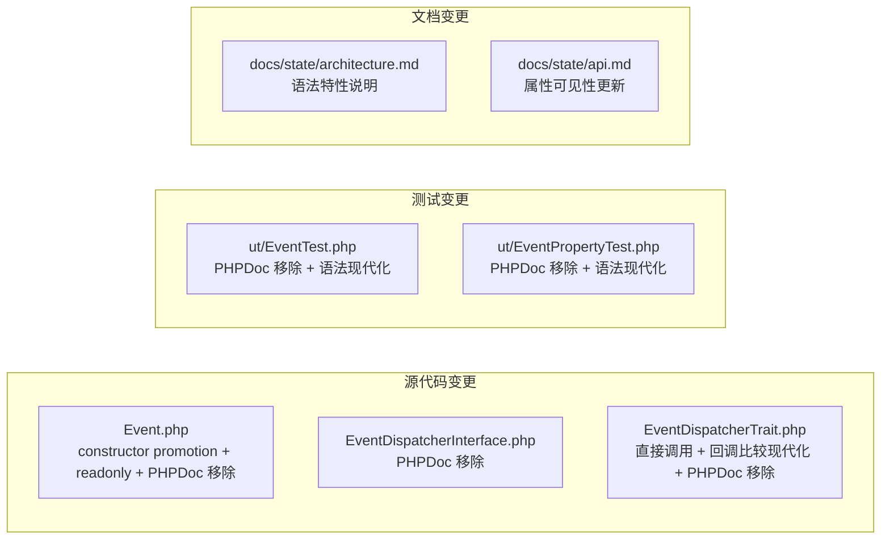

# Design Document

`oasis/event` 3.0 release 的设计文档，所属 spec 目录：`.kiro/specs/release-3.0/`。

---

## Overview

本设计覆盖 `oasis/event` 从 2.0.0 到 3.0 的 PHP 8.1/8.2 语法现代化升级。变更分为五个维度：

1. **Constructor Promotion**：Event 类的构造函数参数提升为 promoted parameters，消除属性声明和赋值的样板代码
2. **Readonly 属性**：对构造后不可变的 Event 属性添加 `readonly` 修饰符，在类型层面保证不可变性
3. **调用与比较现代化**：EventDispatcherTrait 中 `call_user_func()` 替换为直接调用，`removeEventListener()` 的回调比较逻辑现代化
4. **冗余 PHPDoc 移除**：移除原生类型声明已充分表达的 PHPDoc 类型注释
5. **SSOT 文档同步**：更新 `docs/state/` 反映语法升级后的系统状态

作为 major release，允许 breaking change（属性可见性变更、constructor promotion 影响继承等）。不改变库的功能行为和公开 API 语义。

---

## Architecture

### 现有架构（不变）

库的三层结构保持不变：

```
src/
├── Event.php                      # 事件值对象
├── EventDispatcherInterface.php   # 分发器接口
└── EventDispatcherTrait.php       # 分发器默认实现（trait）
```

使用方通过 `use EventDispatcherTrait` + `implements EventDispatcherInterface` 组合到自己的类中。本次升级不改变这一架构模式。

### 变更影响范围



### 变更依赖关系与执行顺序

变更之间存在依赖关系，决定了实现顺序：

1. **Event 类 constructor promotion + readonly**（Req 1 + Req 2）→ 无依赖，可最先执行
2. **EventDispatcherTrait 调用与比较现代化**（Req 3）→ 无依赖，可与 Event 并行
3. **冗余 PHPDoc 移除**（Req 4）→ 依赖 Req 1 完成（promotion 后 PHPDoc 形态变化）
4. **测试文件语法现代化**（Req 5）→ 依赖所有 `src/` 变更完成
5. **SSOT 文档更新**（Req 8）→ 依赖所有代码变更完成

Req 6（排除确认）和 Req 7（行为不变）为守护性需求，贯穿整个实现过程。


---

## Components and Interfaces

### Event 类（变更后）

Constructor promotion + readonly 后的 Event 类结构：

```php
class Event
{
    protected EventDispatcherInterface $target;
    protected EventDispatcherInterface $currentTarget;

    protected bool $cancelled = false;
    protected bool $propagationStopped = false;
    protected bool $propagationStoppedImmediately = false;

    public function __construct(
        protected readonly string $name,
        protected mixed $context = null,
        protected readonly bool $bubbles = true,
        protected readonly bool $cancellable = true,
    ) {}

    // 所有公开方法签名不变
    public function getName(): string { /* ... */ }
    public function getContext(): mixed { /* ... */ }
    public function setContext(mixed $context): void { /* ... */ }
    public function doesBubble(): bool { /* ... */ }
    public function isCancelled(): bool { /* ... */ }
    public function cancel(): void { /* ... */ }
    public function preventDefault(): void { /* ... */ }
    public function stopPropagation(): void { /* ... */ }
    public function stopImmediatePropagation(): void { /* ... */ }
    public function isPropagationStopped(): bool { /* ... */ }
    public function isPropagationStoppedImmediately(): bool { /* ... */ }
    public function getTarget(): EventDispatcherInterface { /* ... */ }
    public function setTarget(EventDispatcherInterface $target): void { /* ... */ }
    public function getCurrentTarget(): EventDispatcherInterface { /* ... */ }
    public function setCurrentTarget(EventDispatcherInterface $currentTarget): void { /* ... */ }
}
```

**设计决策**：

- **Promoted parameters 可见性保持 `protected`**（CR Q1 决策）：与 2.0 一致，子类可直接访问属性。`$name`、`$bubbles`、`$cancellable` 使用 `protected readonly`，`$context` 使用 `protected`（无 readonly，因 `setContext()` 需要修改）。
- **构造函数体变为空**：所有赋值由 promotion 完成，构造函数体不再需要任何代码。
- **移除原有的独立属性声明**：`$name`、`$context`、`$bubbles`、`$cancellable` 的 `protected` 属性声明和构造函数内的 `$this->xxx = $xxx` 赋值全部移除，由 promoted parameter 替代。
- **非 promoted 属性保留原样**：`$target`、`$currentTarget`、`$cancelled`、`$propagationStopped`、`$propagationStoppedImmediately` 不参与 promotion（它们不是构造函数参数），保持原有的 `protected` 声明和默认值。
- **构造函数 PHPDoc 全部移除**（CR Q3 决策）：promoted parameter 的命名和类型已自文档化，描述性文本冗余。

### EventDispatcherInterface（不变）

接口本身无属性、无构造函数，不涉及 constructor promotion 或 readonly。方法签名在 2.0.0 中已完成类型声明，本次无变更。

唯一可能的变更是 PHPDoc 清理——当前接口中仅 `dispatch()` 方法有 PHPDoc（`/** Dispatches a event */`），这是描述性文本而非类型标签，按 Req 4 AC 2 规则应保留。但该描述过于简单且有语法错误（"a event"），可一并清理。

**设计决策**：移除 `dispatch()` 方法上方的 PHPDoc block（`/** Dispatches a event */`）。理由：描述内容过于简单，方法名 `dispatch` 已自文档化；且原文有语法错误。同时移除文件顶部的 `Created by PhpStorm` 注释块。

### EventDispatcherTrait（变更后）

#### 1. `call_user_func` 替换

`doDispatchEvent()` 方法中的 `call_user_func($callback, $event)` 替换为直接调用 `$callback($event)`：

```php
// Before
call_user_func($callback, $event);

// After
$callback($event);
```

PHP 8 中 `callable` 类型的值可以直接调用，无需 `call_user_func` 中转。行为完全等价。

#### 2. 回调比较逻辑现代化（重点设计）

**现有实现分析**：

当前 `removeEventListener()` 中的比较函数 `$comp` 使用 `is_string`/`is_array` 判断回调类型，分三种情况处理：

```php
$comp = function ($a, $b) {
    if (is_string($a) && is_string($b) && $a == $b) {
        return true;
    }
    if (is_array($a) && is_array($b) && count($a) == 2 && count($b) == 2) {
        if ($a[0] == $b[0] && $a[1] == $b[1]) {
            return true;
        }
    }
    return $a === $b;
};
```

三种回调类型的比较语义：
- **字符串回调**（如 `'myFunction'`）：`==` 比较（等价于 `===`，因为都是 string）
- **数组回调**（如 `[$obj, 'method']`）：逐元素 `==` 比较（对象用 `==` 比较属性值，方法名用 `==` 比较字符串）
- **其它**（Closure 等）：`===` 严格比较（引用相等）

**现代化方案**：

将 `$comp` 闭包替换为直接的 `===` 严格比较：

```php
// Before
$comp = function ($a, $b) { /* is_string/is_array 分支逻辑 */ };
// ... if (!$comp($callback, $listener)) { ... }

// After
// ... if ($callback !== $listener) { ... }
```

**方案合理性分析**：

1. **字符串回调**：`===` 对两个相同字符串返回 `true`，与原 `==` 行为一致。
2. **数组回调**：`===` 要求数组元素逐个 `===` 比较。对于 `[$obj, 'method']` 形式：
   - `$obj` 部分：`===` 要求同一对象实例（引用相等）。原实现用 `==` 比较对象（属性值相等即可）。在实际使用中，`addEventListener` 和 `removeEventListener` 传入的是同一个对象引用（如 `[$this->subscriber, 'func']`），因此 `===` 和 `==` 结果一致。
   - `'method'` 部分：`===` 对两个相同字符串返回 `true`，与原 `==` 行为一致。
3. **Closure**：`===` 行为与原实现完全一致。

**Breaking change 说明**：理论上，如果用户在 `addEventListener` 和 `removeEventListener` 中传入了属性值相等但不是同一实例的两个不同对象（如 `[$objA, 'method']` 和 `[$objB, 'method']`，其中 `$objA == $objB` 但 `$objA !== $objB`），原实现能匹配移除，新实现不能。但这种用法在实际场景中极为罕见——用户几乎总是传入同一个对象引用。作为 3.0 major release，这个 breaking change 是可接受的。

**代码变更后的 `removeEventListener()`**：

```php
public function removeEventListener(string $name, callable $listener): void
{
    if (isset($this->eventListeners[$name]) && is_array($this->eventListeners[$name])) {
        foreach ($this->eventListeners[$name] as $priority => &$list) {
            $new_list = [];
            foreach ($list as $callback) {
                if ($callback !== $listener) {
                    $new_list[] = $callback;
                }
            }
            $list = $new_list;
        }
    }
}
```

#### 3. PHPDoc 清理

- 移除文件顶部的 `Created by PhpStorm` 注释块
- Trait 的 class-level PHPDoc（包含 `@phpstan-require-implements`）保留——这是 PHPStan 注解，不是冗余类型标签
- `$eventListeners` 的 `@var array<string, array<int, array<int, callable>>>` PHPDoc 保留——提供了比原生 `array` 类型更精确的类型信息（Req 4 AC 3）

### PHPDoc 移除规则（全局）

按 Req 4 的规则，逐文件分析：

| 文件 | PHPDoc 块 | 处理 |
|------|-----------|------|
| `Event.php` — 文件头 `Created by PhpStorm` | 非类型 PHPDoc，历史注释 | **移除** |
| `Event.php` — 构造函数 `@param` block | 类型标签与原生声明重复 | **移除**（CR Q3 决策） |
| `Event.php` — `preventDefault()` 的 `/** alias of Event::cancel() */` | 描述性文本，非类型标签 | **保留**（Req 4 AC 2） |
| `EventDispatcherInterface.php` — 文件头 `Created by PhpStorm` | 历史注释 | **移除** |
| `EventDispatcherInterface.php` — `dispatch()` 的 `/** Dispatches a event */` | 描述性文本，但过于简单且有语法错误 | **移除** |
| `EventDispatcherTrait.php` — 文件头 `Created by PhpStorm` | 历史注释 | **移除** |
| `EventDispatcherTrait.php` — class-level `@phpstan-require-implements` | PHPStan 注解 | **保留**（Req 4 AC 2） |
| `EventDispatcherTrait.php` — `$eventListeners` 的 `@var` | 比原生 `array` 更精确 | **保留**（Req 4 AC 3） |
| `ut/EventTest.php` — 文件头 `Created by PhpStorm` | 历史注释 | **移除** |
| `ut/EventPropertyTest.php` — 文件头 PHPDoc | 描述性文本（PBT 说明） | **保留** |

### 测试文件语法现代化

`ut/EventTest.php` 和 `ut/EventPropertyTest.php` 的变更：

- **PHPDoc 移除**：按上表规则处理
- **Constructor promotion**：两个测试文件中无构造函数，不适用
- **`call_user_func` 替换**：两个测试文件中无 `call_user_func` 调用，不适用
- **其它 PHP 8.1/8.2 语法**：两个测试文件已使用现代语法（intersection types `MockObject&EventSubscriberStub`、first-class callable 等），无需额外变更

### Composer 配置（不变）

`composer.json` 不做任何变更。不添加、不移除 `require` 或 `require-dev` 条目，不添加 `version` 字段。

### SSOT 文档更新方案（Req 8）

实现完成后，同步更新以下 state 文档：

**`docs/state/architecture.md`**：
- 技术选型 section：新增说明"代码使用 PHP 8.1/8.2 现代语法（constructor promotion、readonly properties）"

**`docs/state/api.md`**：
- Event section —「构造」代码块：更新构造函数签名，体现 promoted parameters 和 readonly（如 `protected readonly string $name`）
- Event section —「构造」下方说明：在 `$bubbles` 和 `$cancellable` 的说明旁注明 `readonly`；新增 `$name` 为 `readonly` 的说明
- EventDispatcherTrait section —「监听器比较（removeEventListener）」：更新比较逻辑说明，从"字符串 `==` / 数组逐元素 `==` / 其它 `===`"改为"统一使用 `!==` 严格比较"


---

## Data Models

本库不涉及持久化数据模型。核心数据结构为内存中的对象。

### Event 对象状态（3.0 变更后）

| 属性 | 类型 | Readonly | 来源 | 默认值 | 说明 |
|------|------|----------|------|--------|------|
| `$name` | `string` | ✅ | promoted | （构造时必填） | 事件名称 |
| `$context` | `mixed` | ❌ | promoted | `null` | 事件上下文数据，可通过 `setContext()` 修改 |
| `$bubbles` | `bool` | ✅ | promoted | `true` | `true` = 冒泡，`false` = 捕获 |
| `$cancellable` | `bool` | ✅ | promoted | `true` | 是否允许取消 |
| `$cancelled` | `bool` | ❌ | 独立声明 | `false` | 是否已取消 |
| `$propagationStopped` | `bool` | ❌ | 独立声明 | `false` | 传播是否已停止 |
| `$propagationStoppedImmediately` | `bool` | ❌ | 独立声明 | `false` | 是否立即停止传播 |
| `$target` | `EventDispatcherInterface` | ❌ | 独立声明 | （未初始化） | 最初触发事件的分发器 |
| `$currentTarget` | `EventDispatcherInterface` | ❌ | 独立声明 | （未初始化） | 当前处理事件的分发器 |

所有属性可见性均为 `protected`。

### Trait 内部状态（不变）

| 属性 | 类型 | 默认值 | 说明 |
|------|------|--------|------|
| `$eventParent` | `?EventDispatcherInterface` | `null` | 父分发器 |
| `$eventListeners` | `array<string, array<int, array<int, callable>>>` | `[]` | 事件名 → 优先级 → 监听器列表 |
| `$delegateDispatcher` | `?EventDispatcherInterface` | `null` | 委托分发器 |


---

## Correctness Properties

*A property is a characteristic or behavior that should hold true across all valid executions of a system — essentially, a formal statement about what the system should do. Properties serve as the bridge between human-readable specifications and machine-verifiable correctness guarantees.*

### PBT 适用性评估

本次升级以语法现代化为主，大部分需求（Req 1 AC 1-4/6、Req 2、Req 4、Req 5、Req 6、Req 8）为结构性/样式性变更，适合 SMOKE 级别检查（Reflection API 验证、代码审查），不适用 PBT。

以下两类需求涉及运行时行为，适用 PBT：

1. **Req 1 AC 5 / Req 7 AC 3**：Constructor promotion 后构造函数契约保持不变——这与 2.0 Property 1（Event 构造保持值完整性）相同，已有 PBT 测试覆盖（`EventPropertyTest::testEventConstructionPreservesValues`）。3.0 升级后该测试继续运行即可验证，无需新增 property。

2. **Req 3 AC 2-3**：回调比较逻辑现代化——从 `is_string`/`is_array` 分支判断改为统一 `!==` 严格比较。这是本次唯一的行为变更点，需要新增 PBT 验证。

此外，2.0 的 6 个 PBT property（构造值完整性、Context 读写一致性、冒泡 target/currentTarget、捕获 target/currentTarget、removeAll 选择性/全局移除、优先级排序）在 3.0 中继续有效，由现有 `ut/EventPropertyTest.php` 覆盖。Req 7（行为不变）通过全量测试套件运行来验证。

### Property 1: 回调移除正确性（严格比较）

*For any* dispatcher, event name, and listener registered via `addEventListener()`, calling `removeEventListener()` with the same event name and the same listener reference SHALL result in that listener no longer being invoked when the event is dispatched. This holds for all callable types: string callbacks, array callbacks (`[$obj, 'method']` where `$obj` is the same instance), and Closure references.

**Validates: Requirements 3.2, 3.3**

### Property 2: 非目标监听器不受移除影响

*For any* dispatcher with multiple listeners registered on the same event name, calling `removeEventListener()` for one specific listener SHALL NOT affect the invocation of other listeners on that event.

**Validates: Requirements 3.3**

### 2.0 Properties（继承，由现有测试覆盖）

以下 properties 在 2.0 中已定义并有 PBT 测试覆盖，3.0 中继续有效：

| # | Property | 验证 |
|---|----------|------|
| 2.0-P1 | Event 构造保持值完整性 | Req 1.5, Req 7.3 |
| 2.0-P2 | Context 读写一致性 | Req 7.1 |
| 2.0-P3 | 冒泡模式下 target/currentTarget 正确性 | Req 7.5 |
| 2.0-P4 | 捕获模式下 target/currentTarget 与执行顺序 | Req 7.5 |
| 2.0-P5 | removeAllEventListeners 选择性与全局移除 | Req 7.5 |
| 2.0-P6 | 监听器优先级排序 | Req 7.5 |


---

## Error Handling

### 现有错误处理（保持不变）

| 场景 | 行为 |
|------|------|
| 对不可取消的 Event 调用 `cancel()` / `preventDefault()` | 抛出 `\LogicException("Cancelling an event which is not cancellable!")` |
| 使用 `EventDispatcherTrait` 但未实现 `EventDispatcherInterface` 的类调用 `dispatch()` | 抛出 `\LogicException("Class {ClassName} uses EventDispatcherTrait but does not implement EventDispatcherInterface.")` |

### Readonly 引入的新错误场景

添加 `readonly` 修饰符后，PHP 引擎会在以下场景自动抛出 `Error`：

| 场景 | 错误类型 | 说明 |
|------|----------|------|
| 子类尝试修改 `$name`、`$bubbles`、`$cancellable` | `Error: Cannot modify readonly property` | 这是 `readonly` 的预期行为，属于 breaking change |
| 外部代码尝试直接赋值 readonly 属性 | `Error: Cannot modify readonly property` | 属性为 `protected`，外部本就无法访问 |

这些是 PHP 8.1 `readonly` 的标准行为，无需额外处理。作为 3.0 major release，子类如需修改这些值应通过构造函数参数传入。

### 回调比较变更的影响

`removeEventListener()` 从 `==` 改为 `===` 比较后，以下边界场景行为变化：

| 场景 | 2.0 行为 | 3.0 行为 |
|------|----------|----------|
| `addEventListener('e', [$objA, 'method'])` 后 `removeEventListener('e', [$objB, 'method'])`（`$objA == $objB` 但 `$objA !== $objB`） | 成功移除 | **不移除**（breaking change） |
| `addEventListener('e', [$obj, 'method'])` 后 `removeEventListener('e', [$obj, 'method'])`（同一对象引用） | 成功移除 | 成功移除 |
| `addEventListener('e', $closure)` 后 `removeEventListener('e', $closure)`（同一 Closure 引用） | 成功移除 | 成功移除 |
| `addEventListener('e', 'myFunc')` 后 `removeEventListener('e', 'myFunc')` | 成功移除 | 成功移除 |

---

## Testing Strategy

### 测试框架

- **框架**：PHPUnit ^11.0
- **Property-Based Testing 库**：Eris（`giorgiosironi/eris ^1.1`，已在 `require-dev` 中）
- **配置**：`phpunit.xml`
- **测试目录**：`ut/`

### 测试分层

#### 1. Smoke Tests（结构验证）

覆盖 Req 1 AC 1-4/6、Req 2、Req 6、Req 7 AC 3-4 的结构性检查。

使用 PHP Reflection API 验证：

| 验证项 | 方法 |
|--------|------|
| 构造函数参数是否为 promoted | `ReflectionParameter::isPromoted()` |
| `$name`、`$bubbles`、`$cancellable` 是否 readonly | `ReflectionProperty::isReadOnly()` |
| `$context` 是否非 readonly | `ReflectionProperty::isReadOnly()` 返回 false |
| 生命周期属性是否非 readonly | 同上，检查 `$cancelled` 等 5 个属性 |
| 构造函数参数顺序、类型、默认值 | `ReflectionMethod::getParameters()` |
| EventDispatcherInterface 方法签名不变 | `ReflectionClass::getMethods()` |

#### 2. Example-Based Unit Tests（具体场景）

覆盖 Req 3 AC 2-3 的回调比较变更和 Req 3 AC 1/4 的直接调用替换。

| 测试场景 | 验证内容 |
|----------|----------|
| 字符串回调的添加与移除 | `addEventListener('e', 'func')` → `removeEventListener('e', 'func')` → dispatch 不触发 |
| 数组回调（同一对象引用）的添加与移除 | `addEventListener('e', [$obj, 'm'])` → `removeEventListener('e', [$obj, 'm'])` → dispatch 不触发 |
| Closure 回调的添加与移除 | 同一 Closure 变量的添加与移除 |
| 直接调用替换后监听器仍正确接收 Event 参数 | dispatch 后监听器收到的参数是 Event 实例 |

#### 3. Property-Based Tests（通用属性验证）

**新增 PBT**（3.0 新增 property）：

| Property | 生成器 | 验证 |
|----------|--------|------|
| Property 1: 回调移除正确性 | 随机事件名 + 随机数量的监听器（Closure），随机选择一个移除 | 被移除的监听器不再触发，其余监听器正常触发 |
| Property 2: 非目标监听器不受移除影响 | 随机事件名 + 多个监听器，移除其中一个 | 未被移除的监听器全部正常触发 |

**继承 PBT**（2.0 已有，继续运行）：

| Property | 测试方法 |
|----------|----------|
| 2.0-P1: Event 构造保持值完整性 | `testEventConstructionPreservesValues` |
| 2.0-P2: Context 读写一致性 | `testContextReadWriteConsistency` / `testDispatchContextSetsEventContext` |
| 2.0-P3: 冒泡 target/currentTarget | `testBubblingModeTargetAndCurrentTarget` |
| 2.0-P4: 捕获 target/currentTarget | `testCapturingModeTargetAndCurrentTargetAndOrder` |
| 2.0-P5: removeAll 选择性/全局 | `testRemoveAllEventListenersSelectiveRemoval` / `testRemoveAllEventListenersGlobalRemoval` |
| 2.0-P6: 优先级排序 | `testListenerPriorityOrdering` |

**PBT 配置**：每个 property 至少 100 次迭代（Eris 默认）。

**Tag 格式**：
```php
// Feature: release-3.0, Property {N}: {property_text}
```

#### 4. Integration Tests（端到端验证）

- 运行完整测试套件 `vendor/bin/phpunit`，验证 Req 5 AC 4 和 Req 7 AC 2（无错误、无弃用警告）
- 验证所有 2.0 PBT 测试在 3.0 代码上仍通过

### 验证流程

实现完成后，执行以下验证：

```bash
vendor/bin/phpunit
```

全部测试通过且无 deprecation warning 即为验证通过。


---

## Impact Analysis

### 受影响的 State 文档

| 文件 | 受影响 Section | 变更内容 |
|------|---------------|----------|
| `docs/state/architecture.md` | 技术选型 | 新增 PHP 8.1/8.2 现代语法说明（constructor promotion、readonly） |
| `docs/state/api.md` | Event — 构造 | 更新构造函数签名，体现 promoted parameters |
| `docs/state/api.md` | Event — 属性 | 注明 `$name`、`$bubbles`、`$cancellable` 为 readonly |
| `docs/state/api.md` | EventDispatcherTrait — 监听器比较 | 更新比较逻辑说明为统一 `!==` 严格比较 |

### 现有行为变化

- **Readonly 属性**（breaking）：`$name`、`$bubbles`、`$cancellable` 添加 `readonly`，子类无法在构造后修改这些属性
- **回调比较逻辑**（breaking）：`removeEventListener()` 从 `==` 改为 `===` 比较，属性值相等但非同一实例的对象不再匹配
- **Constructor promotion**（breaking）：属性声明方式变化，可能影响依赖 Reflection 的下游代码

### 数据模型变更

不涉及持久化数据模型。内存中的 Event 对象属性结构不变，仅声明方式变化（promoted + readonly）。

### 外部系统交互

不涉及。本库无外部系统依赖。

### 配置项变更

无。`composer.json` 和 `phpunit.xml` 均不变。

---

## Socratic Review

**Q: design 是否完整覆盖了 requirements 中的每条需求？有无遗漏？**

逐条核对：
- Req 1（constructor promotion）→ Event 类 section，设计决策明确了 promoted parameters 的可见性、readonly 组合、构造函数体清空
- Req 2（readonly）→ Event 类 section + Data Models 表格，明确了哪些属性 readonly、哪些不 readonly
- Req 3（调用与比较现代化）→ EventDispatcherTrait section，详细设计了 `call_user_func` 替换和回调比较逻辑现代化方案
- Req 4（PHPDoc 移除）→ PHPDoc 移除规则表格，逐文件逐 block 分析了保留/移除决策
- Req 5（测试文件现代化）→ 测试文件语法现代化 section
- Req 6（排除确认）→ 不涉及设计变更，由 Composer 配置不变 section 覆盖
- Req 7（行为不变）→ Testing Strategy 中的 Integration Tests + 继承 PBT
- Req 8（SSOT 文档）→ SSOT 文档更新方案 section

全部覆盖，无遗漏。

**Q: 回调比较逻辑从 `==` 改为 `===` 是否安全？是否有更保守的方案？**

分析了三种回调类型的影响：字符串和 Closure 行为完全一致；数组回调在"同一对象引用"的正常使用场景下行为一致，仅在"属性值相等但不同实例"的极端场景下有差异。这种极端场景在实际使用中几乎不存在（用户总是传入同一个对象引用来添加和移除监听器）。作为 3.0 major release，这个 breaking change 是可接受的。

更保守的方案是保留原有的分支逻辑不变，但这与 CR Q2 的决策（同时现代化回调比较逻辑）矛盾。

**Q: 是否有过度设计的部分？**

设计聚焦于语法变换，没有引入新的抽象或架构变更。PHPDoc 移除规则以表格形式逐文件列出，确保实现时无歧义。新增的 PBT property 仅 2 个，聚焦于唯一的行为变更点（回调比较逻辑），不过度。

**Q: 接口签名和数据模型是否足够清晰，能让 task 独立执行？**

Event 类的完整变更后结构已给出（promoted parameters + readonly 标注）。EventDispatcherTrait 的 `removeEventListener()` 变更后完整代码已给出。PHPDoc 移除规则以逐文件表格形式呈现。足够清晰。

**Q: Requirements CR 的 3 项决策是否都已体现？**

- CR Q1（保持 `protected` 可见性）→ Event 类设计决策第一条
- CR Q2（同时现代化回调比较逻辑）→ EventDispatcherTrait section 第 2 部分，详细设计了新方案
- CR Q3（构造函数 PHPDoc 全部移除）→ Event 类设计决策最后一条 + PHPDoc 移除规则表格

全部体现。

**Q: Impact Analysis 是否充分？是否有遗漏的受影响模块？**

对照 graphify 图谱的 Community 结构和 Cross-Community Bridges 验证：
- **C0（核心库）→ C1（测试）**：Event 和 EventDispatcherTrait 是 C0↔C1 的桥梁节点。design 中 Testing Strategy 和测试文件语法现代化 section 已覆盖测试侧的影响。
- **C0（核心库）→ C3（SSOT 文档）**：StateAPI 是 C0↔C3 的桥梁节点。design 中 SSOT 文档更新方案已覆盖 `docs/state/architecture.md` 和 `docs/state/api.md` 的更新。
- **C2（工程配置）**：`composer.json` 和 `phpunit.xml` 不变，已在 Composer 配置不变 section 确认。
- **C4（变更历史）**：2.0.0 的 spec 和 changelog 不受影响，3.0 的 changelog 属于 release 流程而非 design 范围。

无遗漏。

**Q: 模块间依赖关系是否会引入循环依赖或过度耦合？**

本次升级不改变模块间依赖关系。graphify 图谱中 Event ↔ EventDispatcherInterface 的双向依赖是事件分发模式的固有特征（Surprising Connections 中已标注为低风险），本次变更不加剧也不改变这一关系。EventDispatcherTrait 对 Event 和 Interface 的依赖方向不变。不引入新的耦合。


---

## Gatekeep Log

**校验时间**: 2025-07-18
**校验结果**: ⚠️ 已修正后通过

### 修正项

- [内容] Socratic Review 补充了 Impact Analysis 充分性自审（对照 graphify 图谱 Community 结构和 Cross-Community Bridges 验证无遗漏）和模块依赖/循环依赖检查（确认不引入新耦合）。
- [内容] SSOT 文档更新方案中 `docs/state/api.md` 的更新位置描述更精确化：原文笼统写"Event section — 属性说明"，但当前 `api.md` 无独立"属性说明"小节，修正为指向具体的「构造」代码块和说明文字。

### 合规检查

- [x] 无 TBD / TODO / 待定 / 占位符
- [x] 无空 section 或不完整的列表
- [x] 内部引用一致（requirements 编号 Req 1-8、CR Q1-Q3 引用正确）
- [x] 代码块语法正确（语言标注、闭合）
- [x] 无 markdown 格式错误
- [x] 一级标题存在且附带定位说明
- [x] 技术方案主体存在，承接了 requirements 中的需求
- [x] 接口签名 / 数据模型有明确定义（Event 类完整结构、removeEventListener 完整代码、Data Models 表格）
- [x] 各 section 之间使用 `---` 分隔
- [x] 每条 requirement 在 design 中都有对应的实现描述（Req 1-8 全覆盖）
- [x] 无遗漏的 requirement
- [x] design 中的方案不超出 requirements 的范围
- [x] Impact Analysis 覆盖：受影响 state 文档、现有行为变化、数据模型变更、外部系统交互、配置项变更
- [x] 利用 graphify 查询结果辅助验证了受影响范围（Community 结构、Cross-Community Bridges）
- [x] 技术选型有明确理由
- [x] 接口签名足够清晰，能让 task 独立执行
- [x] 无过度设计
- [x] 与 state 文档中描述的现有架构一致
- [x] Socratic Review 覆盖充分（requirements 覆盖、技术选型合理性、接口清晰度、过度设计、CR 决策体现、Impact 充分性、模块依赖）
- [x] Requirements CR 回应：Q1（protected 可见性）、Q2（现代化回调比较）、Q3（PHPDoc 全部移除）均已体现
- [x] 文档整体目的达标：技术方案明确、接口可执行、可 task 化

### Clarification Round

**状态**: 待用户回答

**Q1:** Design 中 Smoke Tests 使用 Reflection API 验证 constructor promotion 和 readonly 等结构性属性。这些 Smoke Tests 应该放在哪里？
- A) 作为新增测试方法添加到现有的 `ut/EventTest.php` 中（集中管理，减少文件数）
- B) 创建独立的 `ut/EventStructureTest.php`（结构验证与行为测试分离，职责清晰）
- C) 添加到 `ut/EventPropertyTest.php` 中（与 PBT 放在一起，都是"属性"验证）
- D) 其他（请说明）

**A:** B — 创建独立的 `ut/EventStructureTest.php`，结构验证与行为测试分离。

**Q2:** Design 中新增的 2 个 PBT property（回调移除正确性、非目标监听器不受影响）应该放在哪个测试文件中？
- A) 添加到现有的 `ut/EventPropertyTest.php`（所有 PBT 集中在一个文件）
- B) 创建独立的 `ut/DispatcherPropertyTest.php`（按被测对象分离：Event PBT vs Dispatcher PBT）
- C) 添加到 `ut/EventTest.php`（与现有 example-based 测试放在一起）
- D) 其他（请说明）

**A:** A — 添加到现有的 `ut/EventPropertyTest.php`，所有 PBT 集中在一个文件。

**Q3:** Design 中 PHPDoc 移除和 `Created by PhpStorm` 注释块移除分散在多个文件中。在 task 拆分时，PHPDoc 清理应该如何组织？
- A) 每个源文件的 PHPDoc 清理合并到该文件的主要变更 task 中（如 Event.php 的 PHPDoc 清理与 constructor promotion 合并为一个 task）
- B) 所有文件的 PHPDoc 清理集中为一个独立 task（统一处理，避免遗漏）
- C) `src/` 文件的 PHPDoc 清理合并到各自的 task，`ut/` 文件的 PHPDoc 清理作为独立 task
- D) 其他（请说明）

**A:** B — 所有文件的 PHPDoc 清理集中为一个独立 task。

**Q4:** Design 中 Example-Based Unit Tests（Req 3 AC 2-3 的回调比较变更验证）是新增测试。这些测试应在什么时机编写？
- A) 先写测试再改代码（TDD 风格：先写回调比较的新测试，预期失败，再修改 removeEventListener）
- B) 先改代码再补测试（先完成 EventDispatcherTrait 的代码变更，再补充测试验证）
- C) 代码和测试在同一个 task 中同步完成（不严格区分先后）
- D) 其他（请说明）

**A:** A — 先写测试再改代码（TDD 风格）。
